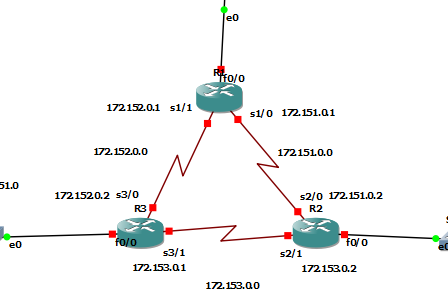

### Universidad de San Carlos de Guatemala, 31 Marzo 2023
### Facultad de Ingeniería
### Escuela de Ciencias y Sistemas
### Redes de Computadoras 1

---
# Redes 1 | Grupo #5 | Proyecto 1
---

> Integrantes
> - Herberth Avila   -    201504464

---
# MANUAL DE CONFIGURACIÓN
---
## CONTENIDO
* [Descripción](#descripción)
* [TOPOLOGIA](#topologia)
  * [Tabla 1](#tabla-1)
  * [Tabla 2](#tabla-2)
* [CONFIGURACION](#configuracion)
  * [RUTAS ESTATICAS](#rutas-estaticas)
    * [Configuracion rutas estaticas](#configuracion-rutas-estaticas)
  * [COMANDOS](#comandos)
  * [TABLAS DE RUTEO](#tablas-de-ruteo)
<!-- toc! -->

---

## Descripción
Configuración de ruteo estático e interfaces Seriales.

---

## TOPOLOGIA
Se debe configurar la siguiente topología, tomando en cuenta los parámetros iniciales y los que se detallan a continuación en cada sección de la topología.

### TABLA 1
Tabla de distribución de direcciones ip correspondientes a cada parte de la topologia. La X significa el [Numero de Grupo + 2 Ultimos numeros de su carnet].
 - Un carnet: 201504464
 - Un grupo: 5
 - [Numero de Grupo + 2 ultimos numeros de su carnet] = (5) + (6 + 4) = 15

| Maquina     | Direccion de Red | Gateway      |
|-------------|------------------|--------------|
| 1           | 192.168.151.0/24 | 192.168.151.1|
| 2           | 192.168.X1.0/24  | 192.168.X1.1 |
| 3           | 192.168.X2.0/24  | 192.168.X2.1 |
| 4           | 192.168.X2.0/24  | 192.168.X2.1 |
| 5           | 192.168.X3.0/24  | 192.168.X3.1 |
| 6           | 192.168.X3.0/24  | 192.168.X3.1 |

Nota: /24 es una notación de máscara subred. Tome en cuenta que esto es equivalente a 255.255.255.0.

### TABLA 2
Tabla de conexion serial entre Routers

| Conexión    | Direccion de Red | Primera Direccion asignable | Gateway   |
|-------------|------------------|-----------------------------|-----------|
| R1 - R2     | 172.151.0.0/16   | 172.151.0.1                 | N.A.      |
| R1 - R3     | 172.X2.0.0/16    | 172.X2.0.1                  | N.A.      |
| R2 - R3     | 172.X3.0.0/16    | 172.X3.0.1                  | N.A.      |

## CONFIGURACION

Se debe de configurar el ruteo estático para que puea existir comunicación entre las diferentes redes.

## RUTAS ESTATICAS

## Configuracion rutas estaticas
Se debe configurar el puerto fastethernet correspondiente a la conexión con el router en modo truncal (dot1q). Esto para cada Switch.

Se deben configurar los puestos seriales en los routers. (NM-4T) en el slot correspondiente a cada router.
 - Slot 1

 - Slot 2

 - Slot 3

### Conexión entre Routers
- R1 -> R2: S1/0 -> S2/0
- R1 -> R3: S1/1 -> S3/0
- R2 -> R3: S2/1 -> S3/1

## COMANDOS

### COMANDOS VPCs
 - VPC1:
   - ip 192.168.151.10 255.255.255.0 192.168.151.1
   - save
 - VPC2:
   - ip 192.168.151.20 255.255.255.0 192.168.151.1
   - save
 - VPC3:
   - ip 192.168.152.10 255.255.255.0 192.168.152.1
   - save
 - VPC4:
   - ip 192.168.152.20 255.255.255.0 192.168.152.1
   - save
 - VPC5:
   - ip 192.168.153.10 255.255.255.0 192.168.153.1
   - save
 - VPC6:
   - ip 192.168.153.20 255.255.255.0 192.168.153.1
   - save

### COMANDOS ROUTERS (interfaces de comunicacion con los switches)
 - R1
   - configure terminal
   - interface f0/0
   - ip address 192.168.152.1 255.255.255.0
   - no shutdown
   - exit
 - R2
   - configure terminal
   - interface f0/0
   - ip address 192.168.153.1 255.255.255.0
   - no shutdown
   - exit
 - R3
   - configure terminal
   - interface f0/0
   - ip address 192.168.151.1 255.255.255.0
   - no shutdown
   - exit

### COMANDOS ROUTERS (interfaces de comunicacion con las VPCs)
 - R1->R2
   - configure terminal
   - interface s1/0
   - ip address 172.151.0.1 255.255.0.0
   - no shutdown
   - exit
 - R2->R1
   - configure terminal
   - interface s2/0
   - ip address 172.151.0.2 255.255.0.0
   - no shutdown
   - exit
 - R1->R3
   - configure terminal
   - interface s1/1
   - ip address 172.152.0.1 255.255.0.0
   - no shutdown
   - exit
 - R3->R1
   - configure terminal
   - interface s3/0
   - ip address 172.152.0.2 255.255.0.0
   - no shutdown
   - exit
 - R3->R2
   - configure terminal
   - interface s3/1
   - ip address 172.153.0.1 255.255.0.0
   - no shutdown
   - exit
 - R2->R3
   - configure terminal
   - interface s2/1
   - ip address 172.153.0.2 255.255.0.0
   - no shutdown
   - exit

### COMANDOS ROUTERS (enrutamiento estatico)
 - R1->R2
   - configure terminal
   - ip route 192.168.153.0 255.255.255.0 172.151.0.2
   - exit
 - R2->R1
   - configure terminal
   - ip route 192.168.152.0 255.255.255.0 172.151.0.1
   - exit
 - R1->R3
   - configure terminal
   - ip route 192.168.151.0 255.255.255.0 172.152.0.2
   - exit
 - R3->R1
   - configure terminal
   - ip route 192.168.152.0 255.255.255.0 172.152.0.1
   - exit
 - R3->R2
   - configure terminal
   - ip route 192.168.153.0 255.255.255.0 172.153.0.2
   - exit
 - R2->R3
   - configure terminal
   - ip route 192.168.151.0 255.255.255.0 172.153.0.1
   - exit
 
## TABLAS DE RUTEO
Muestra de las tablas con 'sh ip int br' y 'sh ip route'
- R1

- R2

- R3

## PING ENTRE MAQUINAS
- PC1

- PC6

## CAPTURA DE PAQUETES CON WIRESHARK
- Seleccionar el cable a capturar la data

- Nombrar la recoleccion de la data

- Hacer ping para generar trafico entre VPCs

